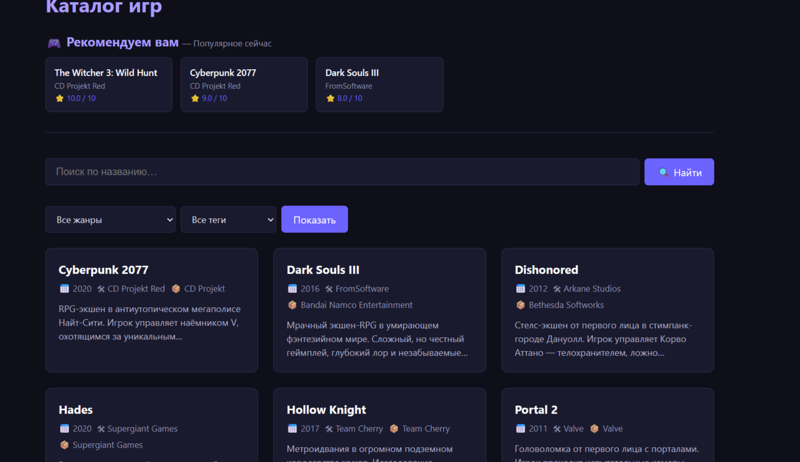
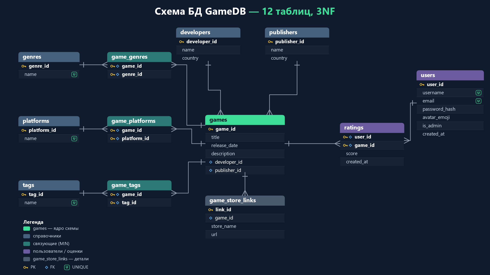
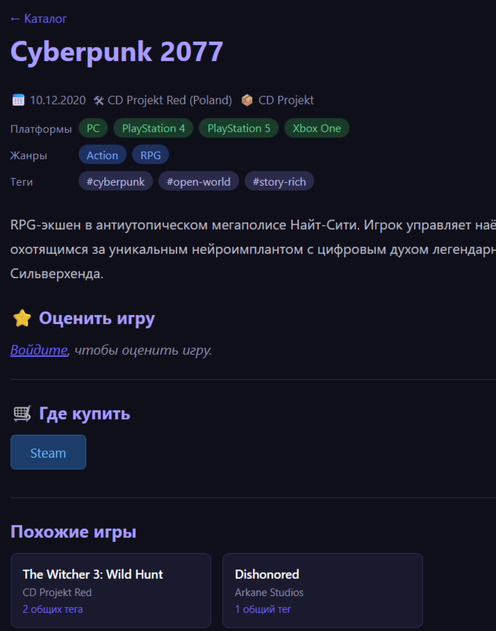

# GameDB — каталог игр с персональными рекомендациями

Учебный проект по дисциплине «Базы данных». Веб-приложение на Flask и PostgreSQL: каталог игр, регистрация, оценки 1–10, и рекомендательный алгоритм, который строит профиль вкуса пользователя по тегам и подбирает под него новые игры.




## Стек

| | |
|---|---|
| БД | PostgreSQL 17 |
| Бэкенд | Python 3.13, Flask, Jinja2 |
| Драйвер | psycopg 3, сырой SQL |
| Пароли | Werkzeug (`generate_password_hash`) |
| ORM | нет — сознательно, см. ниже |

## Схема базы данных



12 таблиц, третья нормальная форма. В центре `games`, вокруг — справочники (`developers`, `publishers`, `genres`, `platforms`, `tags`), связующие таблицы для связей многие-ко-многим (`game_genres`, `game_platforms`, `game_tags`), пользователи с оценками (`users`, `ratings`) и детали (`game_store_links`).

DDL целиком — в [`schema.sql`](schema.sql), тестовые данные — в [`seed.sql`](seed.sql).

## Архитектурные решения и почему так

### Без ORM

SQL написан руками и живёт в `db.py`. Для учебного проекта по базам данных ORM скрыла бы ровно то, что требовалось показать: джойны, агрегаты, CTE, план запроса. С SQLAlchemy код был бы короче и переносимее между СУБД, но рекомендательный запрос всё равно пришлось бы писать сырым SQL или собирать из выражений, читаемых хуже самого SQL.

Цена решения: нет защиты от опечаток в именах колонок на этапе импорта, миграции делаются руками, а при переезде на другую СУБД переписывать пришлось бы много.

### Разделение слоёв

```
app.py       — маршруты, HTTP, сессии, CSRF, авторизация
db.py        — единственное место, где есть SQL
validators.py — серверная валидация входных данных
templates/   — Jinja2, серверный рендеринг
```

Правило простое: в `app.py` нет ни одной строки SQL, в `db.py` нет ни одного обращения к `request` или `session`. Отдельного фронтенда нет — страницы собирает Jinja2.

### Персональные рекомендации на трёх CTE

Ядро проекта — `db.get_recommendations()`. Запрос идёт в три шага:

```sql
WITH taste AS (          -- профиль вкуса: насколько пользователь любит каждый тег
    SELECT gt.tag_id, AVG(r.score) - 5.5 AS affinity
    FROM ratings r
    JOIN game_tags gt ON gt.game_id = r.game_id
    WHERE r.user_id = %s
    GROUP BY gt.tag_id
),
candidates AS (          -- игры, которые пользователь ещё не оценил
    SELECT g.game_id
    FROM games g
    WHERE NOT EXISTS (
        SELECT 1 FROM ratings r
        WHERE r.user_id = %s AND r.game_id = g.game_id
    )
),
scored AS (              -- сумма affinity по всем тегам игры-кандидата
    SELECT c.game_id, SUM(t.affinity) AS rec_score
    FROM candidates c
    JOIN game_tags gt ON gt.game_id = c.game_id
    JOIN taste     t  ON t.tag_id   = gt.tag_id
    GROUP BY c.game_id
)
SELECT ... FROM scored ORDER BY rec_score DESC LIMIT %s
```

Почему вычитается 5.5: это середина шкалы 1–10. Оценка выше неё даёт тегу положительный вес, ниже — отрицательный. Без сдвига любой оценённый тег добавлял бы к `rec_score` только плюс, и алгоритм рекомендовал бы игры с тегами, которые пользователь оценил *низко* — просто потому, что их много.

Почему `NOT EXISTS`, а не `LEFT JOIN ... IS NULL`: планировщик умеет останавливаться на первой найденной строке (anti-join), и намерение читается прямо из текста запроса.

Холодный старт обработан отдельно: при менее чем трёх оценках персональный запрос не имеет статистики, поэтому возвращается глобальный топ с исключением уже оценённых игр. Если персональных результатов меньше, чем нужно, выдача добивается тем же глобальным топом — каждая строка помечена полем `source`, чтобы интерфейс мог различать.

### Транзакция при создании игры

Добавление игры — многошаговая операция: разработчик, издатель, сама игра, жанры, теги, платформы, связи. Всё это в одном блоке `with get_connection() as conn` — при успехе psycopg делает COMMIT, при исключении на любом шаге откатывает всё. Частично созданной игры без жанров в базе появиться не может.

Справочники разрешаются через `INSERT ... ON CONFLICT (name) DO UPDATE ... RETURNING`: если тег уже есть, вернётся его существующий `id`, если нет — создастся новый. Обычный `INSERT` упал бы на UNIQUE, а `SELECT`-затем-`INSERT` оставлял бы окно гонки между двумя параллельными запросами. Дубликаты в связях снимаются через `set(...)` до вставки, чтобы не ловить нарушение составного PK.

### Безопасность

**SQL-инъекции.** Все значения передаются через плейсхолдеры `%s`, пользовательский ввод нигде не склеивается с текстом запроса. Драйвер отправляет запрос и параметры раздельно, поэтому данные не могут быть разобраны как часть SQL.

**Идентификаторы из URL.** Параметры вроде `?genre_id=` проходят через `validators.safe_int()` — не потому, что параметризации мало, а чтобы мусорное значение превращалось в `None` и обрабатывалось как «фильтр не задан», а не улетало в БД и не роняло запрос ошибкой типа.

**Пароли.** В базе только хэши (`generate_password_hash`), открытых паролей не хранится.

**CSRF.** Токен генерируется `secrets.token_hex(32)` при первом обращении к сессии и проверяется в `before_request` для всех мутирующих методов. Сравнение — `hmac.compare_digest`, чтобы время сравнения не зависело от того, сколько первых символов совпало.

**Права БД.** Приложение подключается под выделенной ролью `gamedb_app`, которой выданы только DML-операции (SELECT/INSERT/UPDATE/DELETE). DDL запрещён: даже при найденной уязвимости в приложении через него нельзя выполнить DROP или ALTER и испортить схему.

## Известные ограничения

Честный список того, чего в коде нет:

- **Нет индексов, кроме автоматических на PK и UNIQUE.** В PostgreSQL внешние ключи не индексируются сами по себе, а в `schema.sql` нет ни одного `CREATE INDEX`. Без индекса остались `ratings.game_id`, `game_tags.tag_id`, `game_genres.genre_id`, `games.developer_id` — то есть ровно те колонки, по которым идут джойны в глобальном топе, похожих играх и фильтрах каталога. На объёме тестовых данных это незаметно, на реальном — нет.
- **Нет пагинации.** `get_all_games()` возвращает каталог целиком, без `LIMIT`/`OFFSET`.
- **Нет пула соединений.** `get_connection()` открывает новое соединение на каждый вызов. При нескольких запросах на страницу это несколько лишних рукопожатий с БД.
- **Нет автотестов.** Проверялось вручную.
- **Код процедурный.** Функции и сырой SQL, без классов. Для этой задачи так короче, но это осознанное ограничение, а не показатель.

Первый пункт — самый значимый и самый дешёвый в исправлении; он в начале списка работ.

## Что дальше

- Индексы на внешние ключи и колонки фильтрации, с замером `EXPLAIN (ANALYZE)` до и после
- Пагинация каталога — через keyset, а не `OFFSET`, чтобы не деградировать на больших смещениях
- Пул соединений (`psycopg_pool`)
- Импорт данных из Steam Web API вместо ручного заполнения
- Кэширование тяжёлых запросов

## Запуск

```bash
# 1. Окружение и зависимости
python -m venv venv
venv\Scripts\activate          # Windows
source venv/bin/activate       # Linux / macOS
pip install -r requirements.txt

# 2. Переменные окружения
copy .env.example .env         # Windows
cp .env.example .env           # Linux / macOS
# заполнить DB_PASSWORD и SECRET_KEY

# 3. База
psql -U postgres -c "CREATE DATABASE gamedb;"
psql -U postgres -d gamedb -f schema.sql
psql -U postgres -d gamedb -f seed.sql

# 4. Роль приложения с минимальными правами
psql -U postgres -d gamedb -c "CREATE ROLE gamedb_app LOGIN PASSWORD 'ваш_пароль';"
psql -U postgres -d gamedb -c "GRANT SELECT, INSERT, UPDATE, DELETE ON ALL TABLES IN SCHEMA public TO gamedb_app;"
psql -U postgres -d gamedb -c "GRANT USAGE ON SCHEMA public TO gamedb_app;"

# 5. Старт
python app.py                  # http://localhost:5000
```

## Карточка игры



